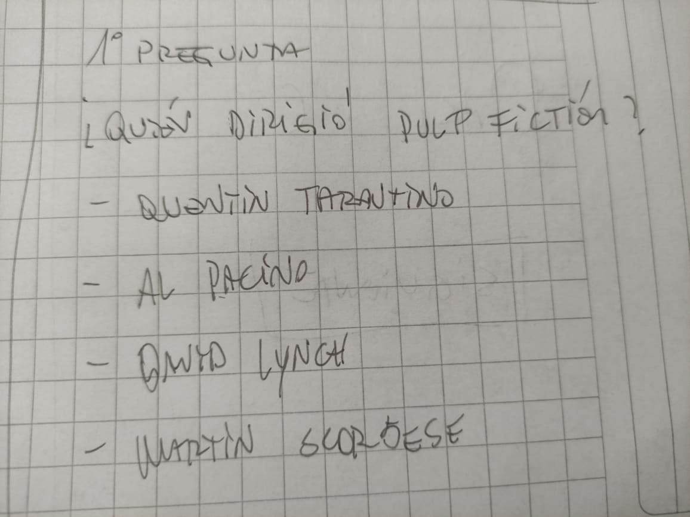

## Proyecto Trivia Laboratoria "NOMBRE TRIVIA"

### 1.- Comenzando 

Comenzamos a estructurar el prototipo cada una, a modo de conocer nuestras impresiones a la forma en que imaginábamos nuestra trivia; “  “

Pelimusic, Entretenimiento …., ¿Cuánto crees conocer de cine y música?, OTROS NOMBRES

IMAGENES DE LOS PROTOTIPOS

 
 
 
 
 
 
 

Estos fueron los prototipos iniciales, pero posteriormente se llevó a producción un prototipo final que incluye elementos de ambos bocetos y ajustandose a nuestros conocimientos y habilidades en código.

### 2.-  Como segundo paso, comenzó la construcción de nuestra trivia y nos centramos en la estructura  HTML

 Empezamos por conocer la nomenclatura y las etiquetas de marcado ya que ninguna de las dos poseía conocimientos previos. Pensamos en la forma de estructurarlo y decidimos que sería por medio de radio buttons (input de tipo radio) y usar diversos archivos para ir a secciones diferentes de la trivia, estas decisiones se basaron en ejemplos de códigos en Github. Finalmente convenimos que no sería la mejor opción y optamos por poner las preguntas en un mismo HTML pero seccionados en “div(s)” que tuvieran la propiedad de estar “escondidos”. 

### 3.- Nuestro próximo destino en el viaje se denomina: “cabeceándose con Javascript” 

Primero que todo, a nuestro entender, Javascript permite al usuario interactuar activamente con los elementos de una página, es decir, - que algo pase cuando apretamos “x” elemento - y así crear dinamismo. Ésto fue lo primero que tuvimos que aprender; cómo darle instrucciones a nuestra página para responder adecuadamente a las acciones del potencial usuario.

Con esto vino el desafió de hacer que nuestras preguntas se mostraran una después de la otra y no todas juntas en la misma pantalla. Para ello al principio decidimos referenciar los botones y que nos llevaran a otro archivo HTML para crear la sensación de pasar a otra pantalla, pero esto creaba mucha confusión y desorden en nuestro código por lo que optamos a mostrarlas de manera “oculta” es decir que siguen en la misma pantalla pero no se ven hasta que se apretara el botón.  En esta búsqueda, descubrimos el atributo “hidden”, onclick, document.getElementById, .addEventListener entre otros.

La dificultad iba en aumento y con ellos llegó el momento de hacer que el usuario pusiera su nombre y se mostrara en la página dicho nombre. Buscamos mucho el cómo guardar y devolver el nombre. 
Decidimos usar un alert con las propiedades if y else, la cual consistía en que si el usuario colocaba su nombre, se mostraba el siguiente mensaje; “hola, -nombre-”, si no lo colocaba entonces se mostraba; “ingresa tu nombre por favor”  sin dejar que avance al menú de inicio de nuestra trivia.

**Uno de nuestros mayores retos fue lograr llamar al valor de las opciones de respuesta marcadas por el usuario, almacenarla y que con esa función, se verifica si la respuesta era correcta o no y que además sumara los puntos obtenidos. Como se puede apreciar en los comentarios del archivo “movies.js” probamos varias opciones posibles, pero solo la que finalmente usamos - document.querySelector - fue la que nos arrojó el resultado esperado.** 

## 4.-  Por último, darle vida a nuestra trivia con CSS

Establecimos una serie de características visuales mínimas que deseábamos que tuviera nuestra webapp y luego buscamos en el tutorial CSS de w3schools qué propiedades y selectores se ajustaban mejor al aspecto que queríamos lograr. 
Por ejemplo, una de las primeras características que queríamos que tuviera nuestra trivia era que el texto desplegado en cada pantalla estuviera dentro de un cuadro; en respuesta a esa necesidad encontramos la propiedad “border”. Luego, al ver el cuadro, nos dimos cuenta que queríamos que el borde del cuadro tuviera las esquinas redondeadas para lo cual nos sirvió la propiedad “border-radius”, so on and so on.

## 5.- Principales desafíos más allá del código

- Problemas con Replit
        Comenzamos a codear con Replit y a menos de una hora de haber empezado nos dimos cuenta que la aplicación nos daba problemas por lo que tuvimos que buscar alternativas entre las que probamos: https://codepen.io/trending  https://liveweave.com, entre otras.
        Finalmente optamos por trabajar en Visual Studio e instalar la extensión Live Share para trabajar en paralelo.

- Conocer el estilo de trabajo de la compañera
        Obviamente que al principio el no conocernos previamente nos atrasó un poco, pero logramos subsanar esta desventaja en el segundo día.

- Nivelar el conocimiento y entendimiento que cada una tenía de lo que teníamos que lograr y las herramientas que íbamos a utilizar para ello.
        En función de optimizar el poco tiempo que teníamos para terminar el proyecto, rápidamente nos dimos cuenta que estudiar las dos juntas no era una opción viable pues ralentizaba el proceso. Fue así como, en primera instancia, nos asignamos un tiempo para estudiar por separado las materias que, a nuestro entender, eran atingentes al proyecto que teníamos prototipado. Luego de ello logramos satisfactoriamente establecer un nivel de conocimiento más o menos similar que nos permitió hablar un lenguaje en común y comenzar a codear juntas. 
        De esta manera desarrollamos una metodología de trabajo que consistía en que: cuando llegábamos a un punto muerto, nos dabamos 15 a 20 min de investigación por separado y luego nos juntábamos nuevamente a compartir las soluciones que cada una encontró y escoger la que fuera más adecuada a nuestra necesidad.

**Nuestras principales fuentes de recursos durante todo este proceso fueron: w3schools,  developers mozilla, youtube, stackoverflow, Github, entre muchas otras.** 

